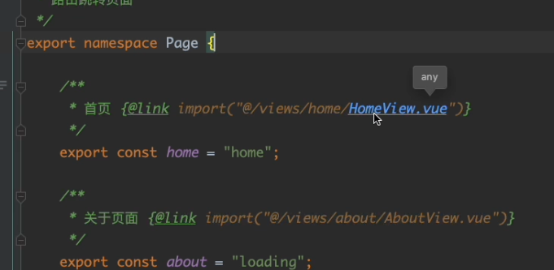
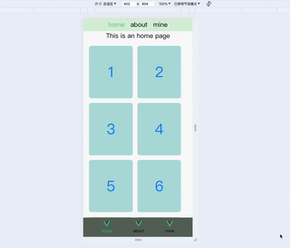
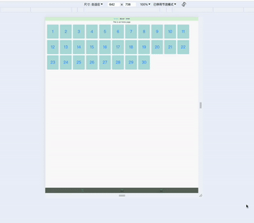

# vue3_vite_template

基于vue3的基础项目模版，使用[vite](https://vitejs.dev/)打包工具，不包含任何UI控件库，可以置入任何自己喜欢的UI控件库，内置了全尺寸适配功能。

如果要开发新项目，该模版可以直接下载好之后，直接在上面进行开发，省去创建项目等时间。

内置依赖：
- router
- axios
- pinia

内置功能：
- 网络请求
- 页面快捷跳转
- 全设备尺寸适配


## 网络请求

请求文件：[request.ts](./src/api/core/request.ts)

请求创建案例：[home.ts](./src/api/home.ts)

## 路由配置

路由路径：[index.ts](./src/router/index.ts)

路由路径管理：[Page.ts](./src/router/Page.ts)

注释写成这种形式是为了方便代码跟踪，直接找到对应组件



 页面跳转
```ts
pageJump(Page.home)
```

## 全设备尺寸适配

手机屏幕适配：



电脑屏幕适配



配置设计稿尺寸：[main.ts](./src/main.ts)，根据你的需求，配置响应的设计稿尺寸
```ts
let designWidth = 1920;// 电脑设计稿宽度
// let designWidth = 375;// 手机设计稿宽度
```

尺寸配置完成后，整个项目，后续开发中，设计稿的长度是多少，在项目中就可以写多少，**和尺寸有关的单位，都要设置为rem**
```ts
.frame_1 {
  line-height: 180rem;
  text-align: center;
  font-size: 50rem;
  color: var(--theme);
  margin: 8rem;
  width: 150rem;
  height: 180rem;
  border-radius: 8rem;
  background-color: rgb(178, 223, 220);
}
```

## 快速体验
```
npm install
```

### 本地运行
```
npm run dev
```

### 项目构建
```
npm run build
```
